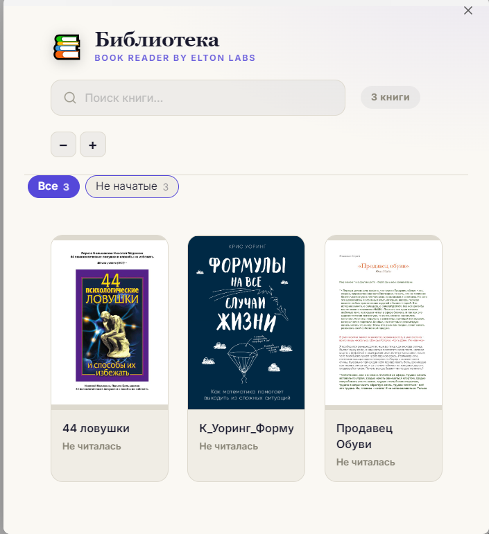
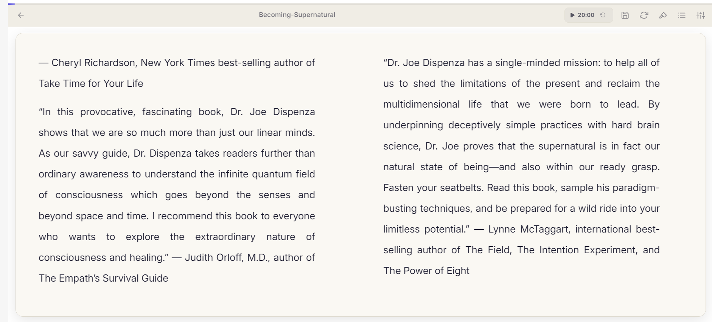

# 📖 Book Reader

Read EPUB, FB2 and PDF books inside Obsidian — with highlights, comments, notes
and reading progress that syncs with your vault.

**[Русский](#-book-reader-по-русски) · English**

Works on desktop and on mobile (Android / iOS).




---

## What it does

**Reading.** EPUB, FB2 and PDF. Paged layout in one or two columns, like a real
book. Dark, light and sepia themes, plus an e-ink mode for Android readers.
Adjustable font, size, line spacing, alignment and line width. Table of contents
built from PDF bookmarks, headings or the book's own printed contents page.
Full-text search across the whole book.

**Highlights and notes.** Four colours. A comment can be attached to any
highlight and travels with it into your notes. Turn a highlight into a note, or
export all of a book's highlights at once — grouped by chapter, with page
numbers.

**Progress.** Stored as files in your vault next to the books, so it rides
whatever you already use to sync (Obsidian Sync, iCloud, Google Drive, Remotely
Save…). The position is anchored by paragraph, so a phone and a desktop find the
same spot at any screen size.

**Library.** A visual grid of every book with covers, progress and categories.
Add books by dragging them in.

---

## Install

### From the community plugins list

Settings → Community plugins → Browse → search for **Book Reader** → Install.

Until the listing goes live, use BRAT below.

### With BRAT

1. Install **BRAT** from the community plugins list.
2. BRAT → *Add beta plugin* → `swayinfo/elton-reader`
3. Enable **Book Reader** in Community plugins.

### By hand

Download `main.js`, `manifest.json` and `styles.css` from the
[latest release](https://github.com/swayinfo/elton-reader/releases/latest)
into `<vault>/.obsidian/plugins/elton-reader-books/`, then reload Obsidian.

---

## Privacy and network use

**The reader works fully offline.** Books, progress, highlights and notes never
leave your device — the PDF engine is bundled into the plugin, so not even fonts
or workers are fetched from the internet.

There is exactly one feature that makes a network request, and it is **off by
default**:

| Feature | Service | What is sent | Default |
|---|---|---|---|
| Translate a selection | Google Translate (`translate.googleapis.com`) | Only the passage you selected | **Off** |
| AI passage breakdown | The service **you** pick — Elton AI (`api.eltonlabs.org`), OpenRouter, OpenAI, or a local Ollama / LM Studio | Only the passage you selected | **Off** |

Both are turned on in *Settings → Translation*, and each says the same thing in
its own description before you enable it. The AI breakdown additionally needs a
provider and a key before it will do anything.

Choosing **Ollama or LM Studio** keeps everything on your own machine — the
passage never reaches the internet at all.

The API key you enter is stored in the plugin's settings inside your vault. If
your vault syncs, the key syncs with it.

No account is required for the plugin itself, and there is no telemetry, no
analytics and no ads.

---

## What's new in 3.0

**Ask an AI about a passage.** Select text and press ✨: a translation, a
breakdown of the words that are actually hard, why the phrasing is what it is,
and the etymology where it helps you remember. Use your own OpenRouter or OpenAI
key, the Elton AI proxy, or a **local Ollama / LM Studio** — with a local model
the passage never leaves your machine. Off until you set it up.

**Copy a passage as a quote, in one click.** The clipboard gets the quote, the
book, the page and a link that opens the book at that exact paragraph — ready to
paste into any note. The shape is a template you can change.

**Quotes link back to the book.** Every exported quote carries a link that opens
the book at the paragraph it came from, and lands there whatever your font size
or column count.

**Read by scrolling** instead of turning pages, if that suits you better.

**Footnotes work in FB2.** Tapping a note number takes you to the note, and a
"back to the text" pill takes you back where you were.

**Highlighting across paragraphs.** A selection spanning several paragraphs used
to be cut off at the end of the first one.

**Nested folders in the library.** Picking a folder now includes everything
inside it, and opens its subfolders as the next step down.

**Reading progress in the book note's properties**, so Bases can chart and sort
it. Off by default.

**Books no longer lose their ending.** The reader measured a book's width using
only its paragraphs, and cut the page flow off at that point — so a book whose
tail was a list, a code listing or a table simply stopped early. Measured in a
real browser: a book needing 119 spreads showed 5. Fixed, and the column stride
is now exact instead of drifting, which also removed the biggest cause of slow
loading in very long books.

**PDF text is no longer glued together.** Title pages came out as
`PRO ВластьRobert GREENEThe 48 laws ofPOWER`. Lines that wrapped back to the left
margin were being joined with nothing between them.

**No more phantom headings in PDFs.** Ordinary sentences were promoted to bold
headings on any page whose average type size was dragged down by small print.

**Separate look on each device.** Font size, theme, spacing and column count are
remembered separately for computer, tablet and phone — a comfortable size on a
tablet no longer makes the text enormous on a phone. Folders, templates and
reading progress stay shared.

**Comments reach your notes.** A comment written under a highlight was dropped
when that highlight became a note. It now travels with the quote.

**Works in a separate window.** Selecting text, page keys and the fullscreen
image viewer were all broken when the book was dragged out into its own window.

**Line width.** Cap lines at 60–90 characters so a maximised window stays
readable.

**Notes open beside the book** instead of replacing it, and can be filed in the
book's own folder.

**Typing a folder path no longer creates a folder per keystroke** on Windows.

**Book files behave like files.** Reveal the open book in the folder tree,
rename, move or delete it from the tab menu.

Full history: [`versions.json`](versions.json) and the release notes.

---

## Building from source

```bash
npm install
npm run build      # -> main.js
npx eslint src/    # community plugin rules
```

The plugin's own code is `src/main.js`. `main.js` at the repository root is the
build output — generated by esbuild, with pdf.js, epub.js, JSZip and localForage
bundled in. `npm run build` on a clean checkout reproduces the released file
byte for byte.

---

## Licence

MIT — see [LICENSE](LICENSE).

Built by **Elton Labs** · [t.me/eltonlabs](https://t.me/eltonlabs)

---
---

# 📖 Book Reader (по-русски)

Читалка **EPUB**, **FB2** и **PDF** прямо внутри Obsidian — с выделениями,
комментариями, заметками и прогрессом чтения, который синхронизируется вместе с
вашим хранилищем.

Работает и на компьютере, и на телефоне (Android / iOS).

---

## Что умеет

**Чтение.** EPUB, FB2 и PDF. Постраничный режим в одну или две колонки, как в
настоящей книге. Тёмная, светлая и сепия темы, отдельный режим для e-ink
читалок. Настраиваются шрифт, размер, интервал, выравнивание и ширина строки.
Оглавление собирается из закладок PDF, заголовков или печатного содержания самой
книги. Поиск по всему тексту.

**Выделения и заметки.** Четыре цвета. К любому выделению можно написать
комментарий — он поедет вместе с цитатой в заметку. Выделение превращается в
заметку одной кнопкой, а все выделения книги выгружаются разом: по главам, с
номерами страниц.

**Прогресс.** Хранится файлами в хранилище, рядом с книгами, поэтому едет тем же
способом, которым вы синхронизируете само хранилище (Obsidian Sync, iCloud,
Google Drive, Remotely Save…). Позиция привязана к номеру абзаца, так что телефон
и компьютер находят одно и то же место при любом размере экрана.

**Библиотека.** Все книги с обложками, прогрессом и категориями. Книги можно
просто перетащить в окно.

---

## Установка

### Из каталога плагинов

Настройки → Сторонние плагины → Обзор → найти **Book Reader** → Установить.

Пока запись в каталоге не опубликована, ставьте через BRAT — ниже.

### Через BRAT

1. Установите **BRAT** из каталога плагинов.
2. BRAT → *Add beta plugin* → `swayinfo/elton-reader`
3. Включите **Book Reader** в списке плагинов.

### Вручную

Скачайте `main.js`, `manifest.json` и `styles.css` из
[последнего релиза](https://github.com/swayinfo/elton-reader/releases/latest)
в папку `<хранилище>/.obsidian/plugins/elton-reader-books/` и перезапустите
Obsidian.

---

## Приватность и интернет

**Читалка работает полностью офлайн.** Книги, прогресс, выделения и заметки
никуда не уходят — движок PDF встроен в плагин, из интернета не подгружается
даже он.

Ровно одна функция ходит в сеть, и она **выключена по умолчанию**:

| Функция | Сервис | Что уходит | По умолчанию |
|---|---|---|---|
| Перевод выделенного | Google Translate (`translate.googleapis.com`) | Только выделенный вами фрагмент | **Выключено** |
| Разбор фрагмента через ИИ | Тот сервис, который **вы** выберете — Elton AI (`api.eltonlabs.org`), OpenRouter, OpenAI или локальный Ollama / LM Studio | Только выделенный вами фрагмент | **Выключено** |

Обе включаются в *Настройки → Перевод*, и у каждой то же самое написано в
описании до того, как вы её включите. Разбору вдобавок нужен выбранный сервис и
ключ — без них он ничего не делает.

Если выбрать **Ollama или LM Studio**, всё остаётся на вашем компьютере —
фрагмент вообще не попадает в интернет.

Ключ хранится в настройках плагина, внутри вашего хранилища. Если хранилище
синхронизируется, ключ едет вместе с ним.

Аккаунт для самого плагина не нужен. Ни телеметрии, ни аналитики, ни рекламы.

---

## Что нового в 3.0

**Разбор фрагмента через ИИ.** Выделяешь текст, жмёшь ✨ — перевод, разбор
действительно трудных слов, объяснение оборота и этимология там, где она помогает
запомнить. Свой ключ OpenRouter или OpenAI, прокси Elton AI либо **локальная
Ollama / LM Studio** — с локальной моделью фрагмент вообще не покидает компьютер.
Выключено, пока не настроите.

**Скопировать фрагмент как цитату — одной кнопкой.** В буфер попадает цитата,
книга, страница и ссылка, открывающая книгу ровно на том абзаце. Вставляйте куда
угодно. Формат задаётся шаблоном.

**Цитаты ведут обратно в книгу.** У каждой выгруженной цитаты есть ссылка на тот
абзац, откуда она взята, и она приводит туда при любом размере шрифта и числе
колонок.

**Чтение прокруткой** вместо страниц, если так привычнее.

**В FB2 работают сноски.** Тап по номеру ведёт к примечанию, а плашка «вернуться
к тексту» возвращает обратно.

**Выделение через несколько абзацев.** Раньше обрезалось по концу первого.

**Вложенные папки в библиотеке.** Выбор папки включает всё внутри неё и открывает
подпапки следующим уровнем.

**Прогресс чтения в свойствах заметки книги** — чтобы работало в Bases.
Выключено по умолчанию.

**Книги больше не теряют концовку.** Ширина книги мерилась только по абзацам, и
по этому же замеру поток обрезался — книга, которая заканчивается списком, кодом
или таблицей, просто вставала раньше времени. Замер в настоящем браузере: книга,
которой нужно 119 разворотов, показывала 5. Починено. Заодно шаг колонки стал
точным вместо плавающего, а это была главная причина тормозов в очень больших
книгах.

**Текст в PDF больше не слипается.** Титульные страницы выходили как
`PRO ВластьRobert GREENEThe 48 laws ofPOWER`: строки, переносившиеся к левому
краю, склеивались без пробела.

**Больше нет ложных заголовков в PDF.** Обычные предложения становились жирными
заголовками на страницах, где средний размер шрифта занижен мелким кеглем.

**Свой вид на каждом устройстве.** Размер шрифта, тема, интервал и число колонок
запоминаются отдельно для компьютера, планшета и телефона — удобный размер на
планшете больше не делает текст гигантским на телефоне. Папки, шаблоны и прогресс
чтения остаются общими.

**Комментарии доезжают до заметок.** Комментарий под выделением терялся, когда
выделение превращалось в заметку. Теперь едет вместе с цитатой.

**Работает в отдельном окне.** Выделение текста, листание клавишами и просмотр
картинок на весь экран не работали, если вынести книгу в своё окно.

**Ширина строки.** Ограничение в 60–90 символов, чтобы развёрнутое на весь экран
окно осталось читаемым.

**Заметка открывается рядом с книгой**, а не вместо неё, и может создаваться в
папке самой книги.

**Ввод пути к папке больше не создаёт папку на каждый символ** в Windows.

**С файлом книги можно работать как с файлом:** показать в дереве папок,
переименовать, переместить или удалить прямо из меню вкладки.

Полная история — в [`versions.json`](versions.json) и в описаниях релизов.

---

## Сборка из исходников

```bash
npm install
npm run build      # -> main.js
npx eslint src/    # правила каталога плагинов
```

Собственный код плагина — `src/main.js`. Файл `main.js` в корне репозитория это
результат сборки: его делает esbuild, вкладывая внутрь pdf.js, epub.js, JSZip и
localForage. `npm run build` на чистой копии повторяет опубликованный файл
байт в байт.

---

## Лицензия

MIT — см. [LICENSE](LICENSE).

Сделано **Elton Labs** · [t.me/eltonlabs](https://t.me/eltonlabs)
